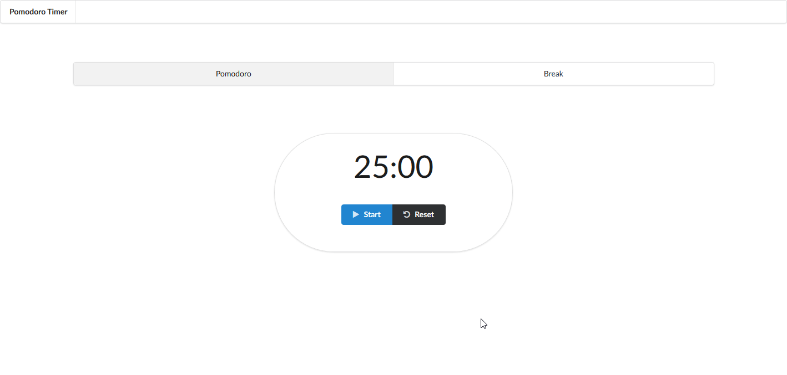

# [Pomodoro Timer](https://kristopherborel.me/pomodoro-timer/)



## Features

- Timers
  - Pomodoro - 25 min
  - Break - 5 min

- Controls
  - Play / Pause
  - Reset

- Alarm sound

- Web Notifications

  

- Title display

  

## Built with

- React
- Redux
- Redux-Saga
- Semantic UI

## Run the project locally

**1.** Clone the project:

```
$ git clone https://github.com/kborel/pomodoro-timer.git
$ cd pomodoro-timer
```

**2.** Install dependencies:

```
$ npm install
```

**3.** Run:

```
$ npm start
```